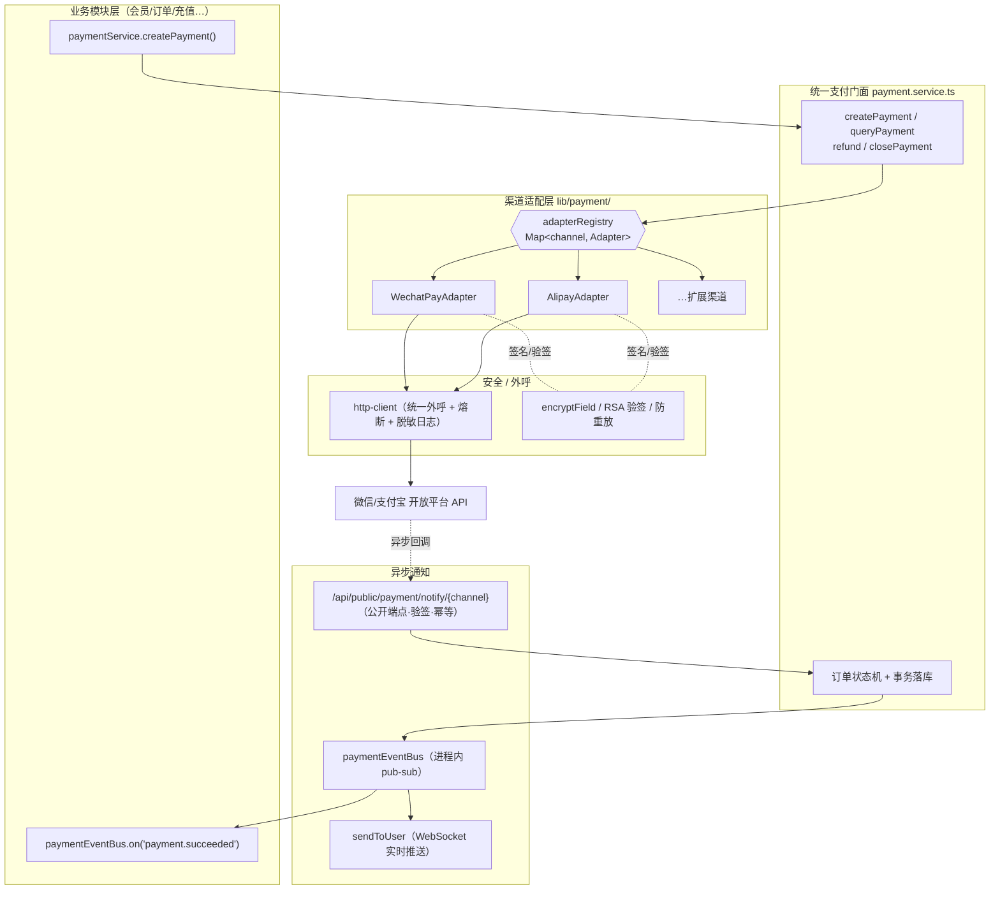
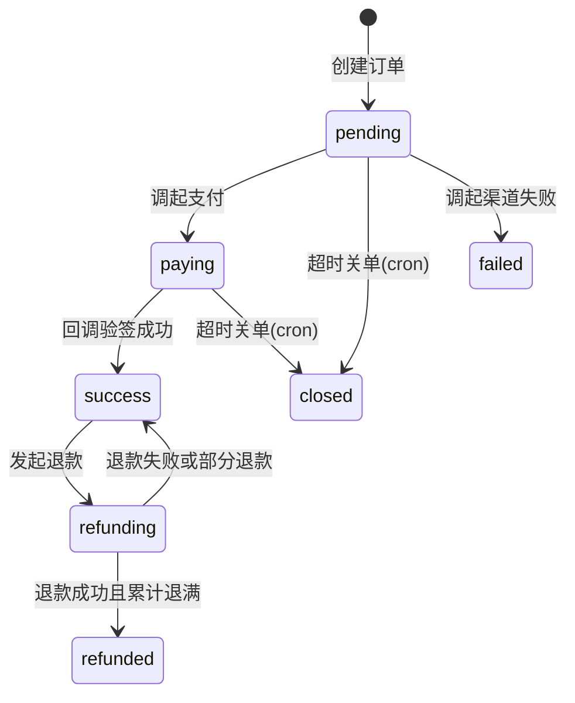

# 支付中心总览

支付中心是 Zenith Admin 的统一支付基础设施。它向上为各业务模块（会员、订单、充值等）提供一套**与渠道无关**的统一接口，向下通过**渠道适配器**对接微信支付、支付宝等开放平台。业务模块只需关心「下单 / 退款 / 监听结果」，无需感知任何渠道差异、签名算法与回调细节。

> 设计目标：新增一个业务接入点 ≈ 调用 1 个函数；新增一个支付渠道 ≈ 实现 1 个接口。

## 文档导航

| 文档 | 内容 |
| --- | --- |
| [渠道适配与配置](./channels) | 渠道适配层接口、新增渠道步骤、渠道配置表、密钥脱敏、连通性测试、设为默认 |
| [业务接入](./integration) | 统一支付门面 API、事件总线订阅、幂等、金额规范、接入示例 |
| [异步通知与对账](./callback) | 回调验签流程、Outbox 可靠投递、对账定时任务、回调日志取证 |
| [安全设计](./security) | 密钥加密、响应脱敏、回调验签、幂等、权限审计、争议取证 |
| [后台管理页面](./admin) | 支付渠道 / 订单 / 退款 / 回调日志四页 + 统计趋势看板 + 导出接口 |

## 1. 架构总览

### 需求映射

| 需求 | 设计落点 | 详见 |
| --- | --- | --- |
| ① 多渠道 | `payment_channel` 枚举 + `adapterRegistry` 注册表 + 每渠道独立 Adapter | [渠道适配](./channels) |
| ② 统一接口 | `payment.service.ts` 门面，业务侧仅调 4 个方法 | [业务接入](./integration) |
| ③ 异步通知 | 公开回调端点验签落库 → `paymentEventBus` → 业务订阅者 + WebSocket | [异步通知](./callback) |
| ④ 退款 | 门面 `refund()` 统一入口，Adapter 各自实现 `refund / queryRefund` | [业务接入](./integration) |
| ⑤ 扩展性 | 新增渠道 = 加枚举 + 实现接口 + 注册，**零改动**业务层与门面 | [渠道适配](./channels) |
| ⑥ 安全 | `encryptField` 存密钥、响应掩码、RSA 验签、幂等、金额整数分、全程 http-client | [安全设计](./security) |

## 2. 关键工程决策

1. **不引入官方 SDK**。项目硬性约定「所有外呼必须走 [`http-client`](../backend/http-client)，禁止裸 `fetch()`」。`alipay-sdk` / `wechatpay-node-v3` 会用各自的 HTTP 客户端绕过该约定（同时绕过熔断、Header 脱敏、结构化日志）。因此用 Node 原生 `crypto` 实现真实签名/验签，HTTP 调用统一走 `lib/http-client.ts`：
   - **支付宝**：`RSA2`（`SHA256withRSA`）/ `RSA`（`SHA1withRSA`）`crypto.createSign` 生成签名、`crypto.createVerify` 验签。
   - **微信支付 v3**：`RSA-SHA256` 请求签名（Authorization 头）+ `AES-256-GCM` 解密回调 `resource` + 平台证书验签。
2. **适配层用接口 + 注册表**，而非 `file-storage.ts` 的平铺 if-else——支付每渠道有约 6 个操作，接口更清晰、扩展更稳。配置表则沿用 `file_storage_configs` 的「大平铺」风格保持一致。
3. **进程内事件总线**，照搬 `lib/workflow-event-bus.ts`。配合 **Outbox 表**保证支付 / 退款成功履约事件「崩溃不丢」，详见 [异步通知与对账](./callback)。
4. **回调 + 主动查单双保险**：不盲信回调，cron 兜底查单，保证状态最终一致。
5. **金额全链路整数分**（`integer`），杜绝浮点误差。

## 3. 数据模型

| 表 | 用途 | 审计列 | 多租户 |
| --- | --- | --- | --- |
| `payment_channel_configs` | 渠道配置（密钥 `encryptField` 加密） | ✅ | ✅ |
| `payment_orders` | 支付单（核心交易表） | ✅ | ✅ + `department_id`(dataScope) |
| `payment_refunds` | 退款单 | ✅ | ✅ |
| `payment_notify_logs` | 回调日志（追加型，取证用） | ❌ | ✅ |
| `payment_events` | 事件 Outbox（保证履约事件可靠投递） | ❌ | ✅ |

### 订单状态机

### 枚举

> pgEnum / TypeScript union / Zod enum **三端必须保持一致**。

| 枚举 | 值 |
| --- | --- |
| `payment_channel` | `wechat` / `alipay` |
| `payment_method` | `wechat_native` / `wechat_jsapi` / `wechat_h5` / `alipay_page` / `alipay_wap` / `alipay_app` |
| `payment_order_status` | `pending` / `paying` / `success` / `closed` / `refunding` / `refunded` / `failed` |
| `payment_refund_status` | `pending` / `processing` / `success` / `failed` |

`PAYMENT_METHOD_CHANNEL`（`@zenith/shared`）维护「支付方式 → 渠道」映射，门面据此自动选择适配器。

## 4. 会员钱包充值联动

会员钱包通过支付中心完成充值闭环：

1. 前台接口 `POST /api/member/wallet/recharge` 使用 `idempotencyGuard({ ttlSeconds: 10 })` 防重复提交；
2. `rechargeWallet()` 调用 `createPayment()`，固定使用 `bizType='member_recharge'`，`bizId` 为会员 ID；
3. `registerPaymentSubscribers()` 订阅 `payment.succeeded`，识别 `member_recharge` 后调用 `creditWalletOnRecharge()`；
4. 入账流水写入 `member_wallet_transactions`，并以支付单号作为 `bizId` 做幂等去重，Outbox 补投不会重复入账。
