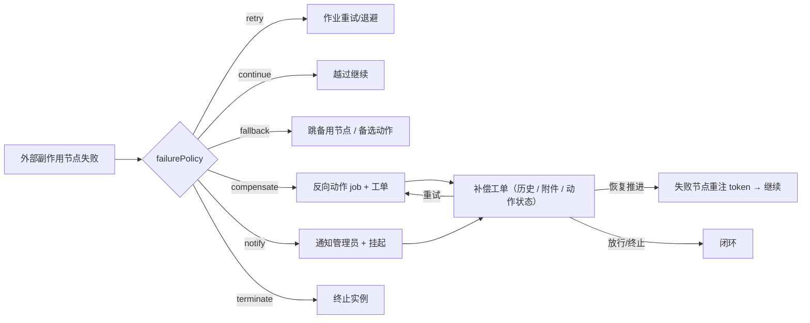

# 补偿 / Saga 能力

工作流引擎在「异常边 → 异常捕获节点（catchNode）」的传统兜底之外，提供一套**节点级统一失败策略（failurePolicy）**与**补偿工单**体系，让外部副作用节点（触发器 / 子流程 / 外部审批等）在失败后能够按预设策略自动恢复、执行反向动作、跳转备用路径，或进入人工修复，而不是只停在异常状态。

## 一、节点级失败策略（failurePolicy）

在流程设计器中，触发器 / 子流程节点的配置面板新增「失败策略（Saga / 补偿）」区域。未启用时沿用传统「异常边 → catchNode」逻辑，完全向后兼容；启用后按 `failurePolicy.action` 分流：

| 动作 | 行为 |
| --- | --- |
| `continue` | 忽略失败，越过该节点继续流转 |
| `retry` | 按 `maxRetries` 自动重试（复用作业引擎指数退避） |
| `compensate` | 执行反向补偿动作（撤单、解锁库存等），并生成补偿工单挂起待确认 |
| `fallback` | 跳转到备用节点（`fallbackNodeKey`）或执行备选动作（`fallbackAction`，如通知失败改发短信）后继续 |
| `notify` | 通知管理员并挂起为「待人工修复」工单 |
| `terminate` | 终止流程实例 |

> 兼容映射：未显式配置 `failurePolicy` 时，`trigger.onFailure=continue/retry` 会被映射为对应策略，`block` 及其它节点仍走异常边 / catchNode。

## 二、反向 / 兜底动作（WorkflowCompensationAction）

`compensate` 的反向动作与 `fallback` 的备选动作共用同一套配置，支持占位符 <code v-pre>{{form.字段}}</code> / <code v-pre>{{instanceId}}</code> / <code v-pre>{{nodeKey}}</code> / <code v-pre>{{error}}</code>：

| 类型 | 用途与关键字段 |
| --- | --- |
| `http` | 直连 HTTP（如 <code v-pre>DELETE /orders/{{form.orderId}}</code>）：`url` / `httpMethod` / `headers` / `bodyTemplate` |
| `connector` | 经流程连接器调用，复用鉴权 / 限流 / 熔断：`connectorId` / `url`(相对路径) / `bodyTemplate` |
| `sms` | 短信兜底：`templateId` / `recipients` / 模板变量 |
| `email` | 邮件兜底：`recipients` / `bodyTemplate` |
| `updateData` | 回填 / 回滚父实例表单字段（如把 `inventoryLocked` 置回 `false`）：`fieldKeys` / `fieldValues` |

反向动作作为独立作业 `compensation_action` 执行，拥有自己的 `maxRetries`、指数退避与死信，执行结果回写补偿工单的 `compensationActionStatus`。

## 三、Saga 反序回滚

当失败节点的 `failurePolicy.sagaRollback = true` 时，引擎会对该实例**此前所有已成功的副作用节点**（trigger / external / webhook），按成功的**倒序**逐个执行其节点配置的 `compensation` 反向动作，并为每个被回滚的节点生成一条补偿工单。仅回滚声明了 `compensation` 的节点，且每节点幂等去重。

## 四、补偿工单与生命周期

补偿工单（`workflow_compensations`）记录一次失败的处理过程；处理历史（备注 / 附件 / 自动动作结果 / 恢复 / 放行 / 终止）沉淀在 `workflow_compensation_logs`。

- 工单状态 `status`：`pending`（待处理）/ `resolved`（已放行）/ `terminated`（已终止）
- 自动动作状态 `compensationActionStatus`：`none` / `pending` / `running` / `succeeded` / `failed`
- `failedNodeKey`：失败节点 key，用于「恢复后继续推进」时重注 token

运维在「流程监控 → 补偿工单」页可对工单执行：

| 操作 | 说明 | 接口 |
| --- | --- | --- |
| 详情 | 查看错误、自动动作状态与处理历史时间线 | `GET /api/workflows/compensation/{id}` |
| 恢复推进 | 补偿完成后从失败节点继续推进流程 | `POST /api/workflows/compensation/{id}/resume` |
| 重试补偿动作 | 自动动作 `failed` 时重新入队反向动作 | `POST /api/workflows/compensation/{id}/retry` |
| 添加备注 / 附件 | 沉淀处理过程 | `POST /api/workflows/compensation/{id}/note` |
| 放行 / 终止 | 人工放行（保留实例继续）或终止实例 | `POST /api/workflows/compensation/{id}/resolve` |

权限：查看 `workflow:instance:monitor`，操作 `workflow:engine:operate`。

## 五、恢复流程图

## 六、相关数据对象

| 对象 | 说明 |
| --- | --- |
| `workflow_compensations` | 补偿工单：失败节点、错误、动作、状态、自动动作状态、失败节点 key、动作快照 |
| `workflow_compensation_logs` | 工单处理历史：备注 / 附件 / 自动动作结果 / 恢复 / 放行 / 终止 |
| `workflow_jobs`（`compensation_action`） | 反向 / 兜底动作的统一异步作业，复用重试 / 退避 / 死信 |
