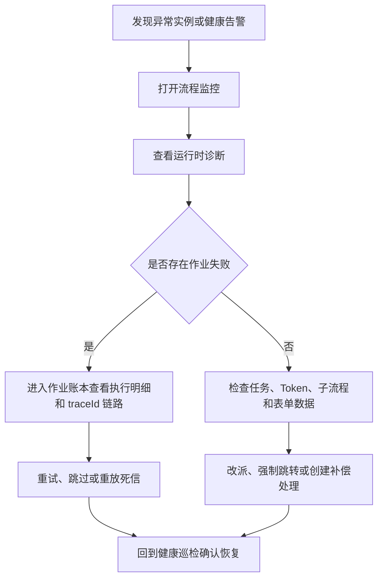

# 监控、诊断与运维

工作流运维围绕实例、任务、执行 Token、异步作业和健康巡检展开。后台入口包括 `流程监控`、`健康巡检`、`事件订阅` 和 `触发器执行`；`流程监控` 内还提供 `引擎诊断`、`作业账本` 和 `补偿工单`。

## 流程监控

`工作流引擎 → 流程监控` 提供实例维度的查询和处置能力：

| 能力 | 说明 |
| --- | --- |
| 实例列表 | 按流程、状态、发起人、时间等维度查询 |
| 流程详情 | 查看实例基础信息、表单数据、当前节点和任务 |
| 运行时诊断 | 汇总节点、任务、触发器、事件派发、执行 Token、定义快照 |
| 强制跳转 | 将实例推进到指定节点 |
| 改派处理人 | 调整待办任务处理人 |
| 批量恢复 | 对卡住实例执行批量跳过或恢复动作 |
| 诊断包导出 | 导出实例运行快照，便于工单留档和离线分析 |

运行时诊断抽屉包含这些视图：

| 视图 | 内容 |
| --- | --- |
| 引擎轨迹 | 实例相关的引擎事件和作业链路 |
| 节点 | 流程图节点状态、当前节点、异常节点 |
| 任务 | 全量任务、处理人、动作、耗时和状态 |
| 触发器 | 节点触发器派发状态、请求、响应和错误 |
| 事件派发 | 事件投递状态、订阅命中和错误 |
| 执行 Token | 并行、包容、子流程等待等执行路径状态 |
| 流程图 | 按运行状态渲染的流程定义快照 |
| 表单数据 | 实例运行时表单数据 |
| 定义快照 | 发起时冻结的流程定义 |

## 健康巡检

`工作流引擎 → 健康巡检` 用于快速识别异常实例和异步执行问题。巡检关注：

| 问题 | 说明 |
| --- | --- |
| 外部审批派发失败或长时间等待 | 审批人节点配置外部审批后，第三方系统未成功接收或未回调 |
| 触发器等待无执行记录 | 触发器节点进入等待态但没有对应执行记录 |
| 触发器执行失败 | 触发器作业请求失败或重试耗尽 |
| 子流程等待 | 父流程等待子流程完成 |
| 延迟器超期 | 延迟节点已到期但未恢复 |
| 待办超时 | 节点配置的 SLA 已超期 |
| 事件派发失败 | 事件分发或 Webhook 投递失败 |
| 执行 Token 异常 | 并行、包容、子流程汇聚路径无法继续 |

健康巡检的阈值由页面参数控制，适合日常看板和问题排查入口。

## 引擎诊断

`流程监控 → 引擎诊断` 展示引擎整体状态、队列分布、健康趋势和恢复动作。运维动作包括：

| 动作 | 说明 |
| --- | --- |
| 重放事件派发 | 重新处理事件派发相关作业 |
| 恢复触发器重派 | 扫描并恢复触发器派发 |
| 恢复延时任务 | 扫描已到期延迟器并恢复流程 |
| 处理超时任务 | 扫描并处理待办超时 |
| 恢复子流程 | 扫描子流程等待和汇聚状态 |

这些动作按恢复扫描设计，适合处理队列积压、进程重启后恢复和外部系统短暂故障后的补偿。

## 作业账本

异步能力统一进入作业账本。作业记录包含类型、状态、关联实例、任务、节点、`traceId`、运行时间、尝试次数、错误和执行明细。

| 作业类型 | 说明 |
| --- | --- |
| `delay_wake` | 延迟器到期唤醒 |
| `task_timeout` | 待办超时处理 |
| `trigger_dispatch` | 触发器节点派发 |
| `external_dispatch` | 外部审批派发 |
| `subprocess_spawn` | 发起子流程 |
| `subprocess_join` | 子流程完成后汇聚 |
| `event_dispatch` | 工作流事件分发 |
| `webhook_delivery` | 事件订阅 Webhook 投递 |

| 状态 | 说明 |
| --- | --- |
| `pending` | 等待执行 |
| `running` | 执行中 |
| `succeeded` | 执行成功 |
| `failed` | 本轮失败，仍可重试 |
| `dead` | 重试耗尽进入死信 |
| `canceled` | 已取消或跳过 |

作业账本支持按类型和状态筛选、查看执行明细、查看同一 `traceId` 的链路、单条重试、单条跳过、批量重试、批量跳过、死信重放和失败原因聚类。

## 补偿工单

补偿工单用于承接需要人工判断的异常实例。工单记录实例、节点、异常原因、处理动作和状态。处理人可以：

| 操作 | 说明 |
| --- | --- |
| 标记修复放行 | 确认外部问题已处理，流程继续运行 |
| 终止流程 | 结束异常实例并跳过待办 |

补偿工单适合外部系统不可用、审批回调无法自动确认、异常路径需要人工兜底的场景。

## 排查顺序

