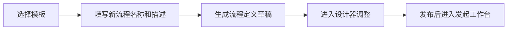

# 流程模板

流程模板用于沉淀可复用的流程结构和表单结构。管理员可以在流程定义中把成熟配置另存为模板，也可以在模板库中维护通用模板，再从模板生成新的草稿流程。

## 模板内容

模板保存以下信息：

| 字段 | 说明 |
| --- | --- |
| 模板名称 | 模板在列表和选择弹窗中的展示名 |
| 模板编码 | 可选的唯一标识 |
| 描述 | 说明适用场景 |
| 分类 | 用于模板列表筛选和流程定义创建时的归类 |
| 图标 / 颜色 | 模板卡片展示样式 |
| 流程结构 | 设计器中的节点、分支、条件和节点配置 |
| 表单结构 | 可视化表单字段、校验、布局和联动配置 |
| 排序 | 模板列表展示顺序 |
| 内置标记 | 内置模板可编辑，但不允许删除 |

模板本身不是可运行流程。只有从模板创建流程定义并发布后，用户才能在发起工作台使用。

## 入口

| 入口 | 能力 |
| --- | --- |
| `工作流引擎 → 流程模板` | 查看、搜索、编辑、删除模板，从模板新建流程 |
| `工作流引擎 → 流程定义` | 打开模板选择弹窗，从模板创建草稿流程 |
| 流程定义操作 | 将已有流程定义另存为模板 |

## 从模板创建流程

从模板创建流程时，系统复制模板中的 `flowData` 和 `formSchema`，并生成一条新的流程定义草稿。创建时可填写新流程的名称和描述，创建完成后进入流程定义列表继续设计、体检和发布。

模板不会绑定运行实例。实例运行使用流程定义发布时的快照，后续修改模板不会影响已经创建的流程定义或运行中的流程实例。

## 另存为模板

流程定义可以另存为模板，用于把已经验证过的设计沉淀到模板库。另存内容包括流程结构和表单结构，适合以下场景：

| 场景 | 示例 |
| --- | --- |
| 固定审批模型 | 请假、报销、合同审批、采购申请 |
| 多业务复用 | 不同部门使用相同节点结构，只调整发起范围和审批人 |
| 复杂流程沉淀 | 包含分支、触发器、子流程、外部审批的流程 |
| 标准化交付 | 给新租户或新组织快速生成标准流程 |

## 维护建议

- 模板名称写业务场景，流程定义名称写具体落地场景。
- 把通用字段放在模板表单中，把具体业务字段留给新流程调整。
- 模板中可以保留节点 `key`，便于事件订阅、外部回调和监控诊断继续使用稳定标识。
- 修改内置模板适合更新默认配置；删除模板只适合自建模板。
